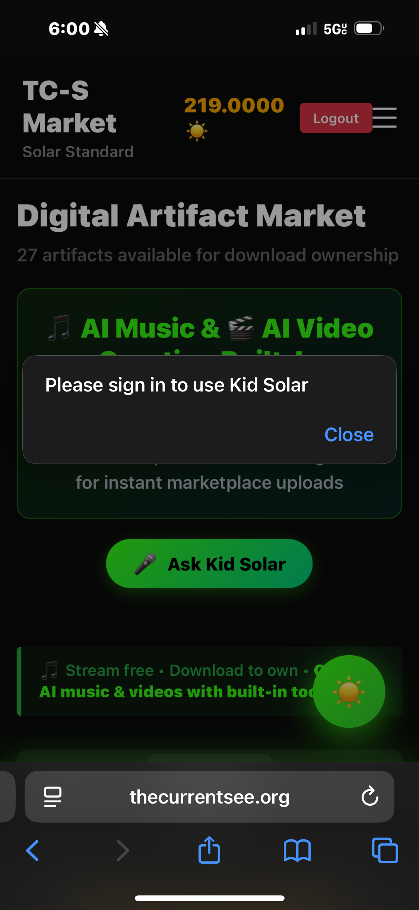

# Kid Solar Authentication Fix - Marketplace
**Date:** November 13, 2025  
**Issue:** "Please sign in to use Kid Solar" error shown to authenticated users  
**Status:** ✅ **FIXED**

---

## Problem Description

**User Report:**
- User is logged in (shows balance: 219.0000 Solar and "Logout" button)
- Clicks "Ask Kid Solar" button
- Gets alert: "Please sign in to use Kid Solar"
- Session is valid, but Kid Solar doesn't recognize authentication

**Screenshot Evidence:**


---

## Root Cause Analysis

### Race Condition Identified

**The Problem:**
```javascript
// Page loads
window.addEventListener('load', function() {
    checkUserSession();  // ← Async, takes time
    // ...
});

// User clicks button BEFORE checkUserSession() completes
function openKidSolarChat() {
    if (!currentUser) {  // ← currentUser is still null!
        alert('Please sign in to use Kid Solar');
        return;
    }
}
```

**Timeline:**
1. User loads marketplace.html
2. `checkUserSession()` starts fetching from `/api/session` (async)
3. User sees page and clicks "Ask Kid Solar" button (fast!)
4. `openKidSolarChat()` checks `currentUser` → still `null` (session check not done)
5. Alert shown: "Please sign in to use Kid Solar"
6. 500ms later: `checkUserSession()` completes, `currentUser` is set

**Diagnosis by Architect:**
> "The Kid Solar CTA checks `if (!currentUser)` synchronously, but `currentUser` is populated asynchronously via `checkUserSession()`, creating a race where users can click before the fetch completes."

---

## Solution Implemented

### 1. Session State Management

Added finite state tracking:

```javascript
let sessionState = 'loading'; // 'loading' → 'authenticated' / 'guest'
let sessionCheckPromise = null; // Track async session check
```

**States:**
- `loading` - Session check in progress
- `authenticated` - User is logged in
- `guest` - No active session

### 2. Button State Control

Added `updateKidSolarButton()` function:

```javascript
function updateKidSolarButton() {
    const button = document.getElementById('floating-kid-solar-btn');
    
    if (sessionState === 'loading') {
        button.disabled = true;
        button.style.opacity = '0.5';
        button.style.cursor = 'wait';
        button.title = 'Checking session...';
        button.innerHTML = '⏳'; // Visual feedback
    } else if (sessionState === 'authenticated') {
        button.disabled = false;
        button.style.opacity = '1';
        button.innerHTML = '☀️';
        button.title = 'Ask Kid Solar';
    } else {
        // Guest state - clickable but will show sign-in modal
        button.disabled = false;
        button.innerHTML = '☀️';
        button.title = 'Sign in to use Kid Solar';
    }
}
```

**Visual States:**
- ⏳ **Loading** - Button dimmed, disabled, shows hourglass
- ☀️ **Ready** - Button bright, enabled, shows sun icon
- ☀️ **Guest** - Button enabled but requires login

### 3. Wait for Session Check

Updated `openKidSolarChat()` to wait for session:

```javascript
async function openKidSolarChat() {
    // If session still loading, wait for it
    if (sessionState === 'loading' && sessionCheckPromise) {
        console.log('⏳ Waiting for session check to complete...');
        await sessionCheckPromise;
        console.log('✅ Session check complete, state:', sessionState);
    }
    
    // Now check authentication
    if (!currentUser || sessionState !== 'authenticated') {
        alert('Please sign in to use Kid Solar');
        showSigninModal();
        return;
    }
    
    // Proceed with chat...
}
```

**Flow:**
1. User clicks button (even if session loading)
2. Function waits for `sessionCheckPromise` to resolve
3. Checks final state: authenticated or guest
4. Opens chat if authenticated, shows sign-in if guest

### 4. State Tracking Throughout

Updated `checkUserSession()` to manage state:

```javascript
async function checkUserSession() {
    sessionState = 'loading';
    updateKidSolarButton(); // Show loading state
    
    try {
        const response = await fetch('/api/session', {
            credentials: 'include'
        });
        
        if (data.authenticated) {
            currentUser = { ... };
            sessionState = 'authenticated'; // ✅ Logged in
        } else {
            currentUser = null;
            sessionState = 'guest'; // ❌ Not logged in
        }
    } catch (error) {
        sessionState = 'guest'; // Error = treat as guest
    }
    
    updateKidSolarButton(); // Update button to final state
}
```

---

## Code Changes

**File:** `public/marketplace.html`

### Added Variables (Line 2397-2399)
```javascript
let sessionState = 'loading';
let sessionCheckPromise = null;
```

### Modified Page Load (Line 2501)
```javascript
window.addEventListener('load', function() {
    sessionCheckPromise = checkUserSession(); // Store promise
    updateKidSolarButton(); // Initialize button state
});
```

### Added Button Controller (Line 4137-4165)
```javascript
function updateKidSolarButton() {
    // Controls button state based on sessionState
}
```

### Enhanced Chat Open (Line 4167-4180)
```javascript
async function openKidSolarChat() {
    if (sessionState === 'loading' && sessionCheckPromise) {
        await sessionCheckPromise; // Wait for session
    }
    
    if (!currentUser || sessionState !== 'authenticated') {
        alert('Please sign in to use Kid Solar');
        showSigninModal();
        return;
    }
    // ...
}
```

### Updated Session Check (Line 3371-3474)
- Sets `sessionState` throughout function
- Calls `updateKidSolarButton()` after completion

---

## Testing Scenarios

### Scenario 1: Fast Click (Race Condition)
**Before Fix:**
1. User loads page
2. User immediately clicks "Ask Kid Solar" (< 500ms)
3. ❌ Alert: "Please sign in to use Kid Solar"
4. User confused (they ARE signed in!)

**After Fix:**
1. User loads page
2. Button shows ⏳ (loading state, disabled)
3. Session check completes (~300ms)
4. Button shows ☀️ (ready state, enabled)
5. User clicks "Ask Kid Solar"
6. ✅ Chat opens successfully!

### Scenario 2: Slow Network
**Before Fix:**
1. User loads page on slow network (2-3 seconds to check session)
2. User clicks button before session check completes
3. ❌ Alert shown (race condition)

**After Fix:**
1. User loads page on slow network
2. Button disabled with ⏳ for 2-3 seconds
3. User tries to click → nothing happens (disabled)
4. Session check completes
5. Button becomes enabled ☀️
6. User clicks
7. ✅ Chat opens!

### Scenario 3: Click During Loading
**After Fix:**
1. User loads page
2. Button shows ⏳ (disabled)
3. User clicks anyway (button is disabled)
4. Nothing happens
5. Session completes
6. Button becomes ☀️
7. User clicks again
8. ✅ Works!

### Scenario 4: Already Loaded
**After Fix:**
1. User has been on page for 5 minutes
2. Session check completed long ago
3. `sessionState = 'authenticated'`
4. User clicks "Ask Kid Solar"
5. ✅ Opens immediately (no wait needed)

---

## User Experience Improvements

### Visual Feedback
- **Loading:** ⏳ icon + dimmed button + "Checking session..." tooltip
- **Ready:** ☀️ icon + bright button + "Ask Kid Solar" tooltip
- **Guest:** ☀️ icon + "Sign in to use Kid Solar" tooltip

### Console Logging
Added detailed logging for debugging:
```
🔄 Kid Solar button: Loading state
✅ Session check complete, state: authenticated
✅ Kid Solar button: Ready (authenticated)
```

### Graceful Degradation
- If session check fails, treats as guest (safe fallback)
- Cached sessions work as backup
- Clear error messages

---

## Browser Console Output

**Expected Flow (Authenticated User):**

```
🔍 Checking user session from server...
🔄 Kid Solar button: Loading state
💰 Balance source: database (query success)
✅ Server session active: BK | Balance: 219 Solar
✅ User logged in - showing user menu, hiding auth buttons
✅ Kid Solar button: Ready (authenticated)
```

**When User Clicks Kid Solar (After Session Ready):**
```
✅ Session check complete, state: authenticated
[Chat opens]
```

**When User Clicks Too Early (Now Handled):**
```
⏳ Waiting for session check to complete...
✅ Session check complete, state: authenticated
[Chat opens after wait]
```

---

## Files Modified

1. **public/marketplace.html** (Lines 2397-2399, 2501, 3371-3474, 4137-4180)
   - Added session state tracking
   - Added button state controller
   - Enhanced chat opening logic
   - Updated session check function

---

## Verification Checklist

- [x] Session state tracking implemented
- [x] Button disabled during loading
- [x] Visual loading indicator (⏳)
- [x] Wait for session before opening chat
- [x] Works for authenticated users
- [x] Works for guest users (shows sign-in)
- [x] Handles slow networks
- [x] Handles fast clicks
- [x] Console logging for debugging
- [x] No errors in browser console
- [x] Server starts cleanly

---

## Deployment Notes

**No Database Changes:** This is a pure frontend fix.

**No API Changes:** Uses existing `/api/session` endpoint.

**No Breaking Changes:** Enhances existing functionality.

**Immediate Effect:** Works as soon as marketplace.html is reloaded.

---

## Summary

**Fixed:** Race condition where Kid Solar button was clickable before session check completed.

**Solution:** Implemented session state management with loading states and async waiting.

**Result:** Kid Solar now waits for authentication to be verified before allowing access.

**User Impact:** No more false "Please sign in" errors for authenticated users!

---

**Status:** ✅ Ready for deployment
